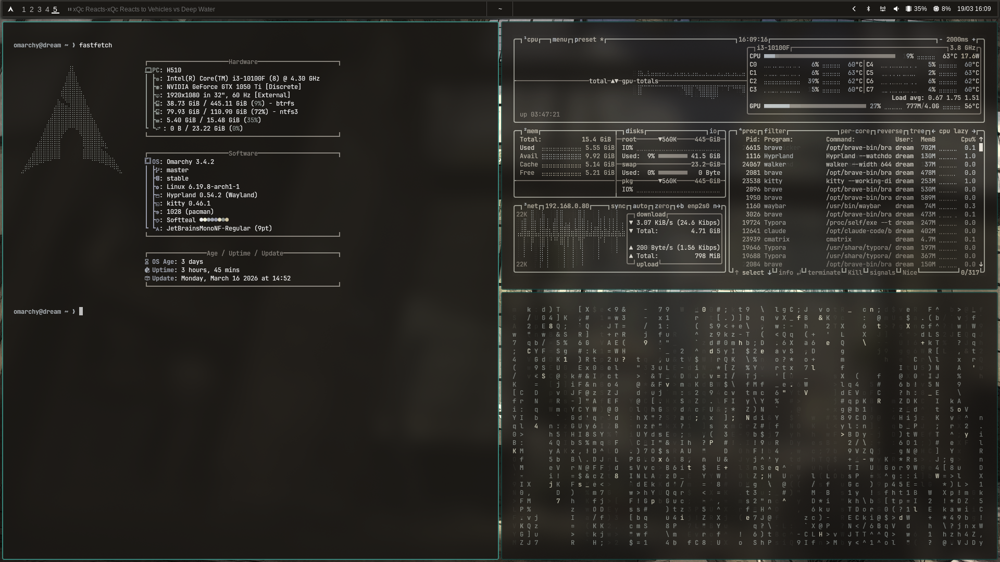

# dotfiles

personal omarchy cfg (hypr + waybar)

# set up

run the script sync.sh to sync up automatically

```bash
chmod +x /home/user/Repositories/dotfiles/sync.sh
```

then cd into the repo and run 
```bash
.\sync.sh
```

i am currently using the softteal theme: https://github.com/atif-1402/omarchy-softteal-theme, with my own waybar.
# preview:

<p align="center">
  
</p>
